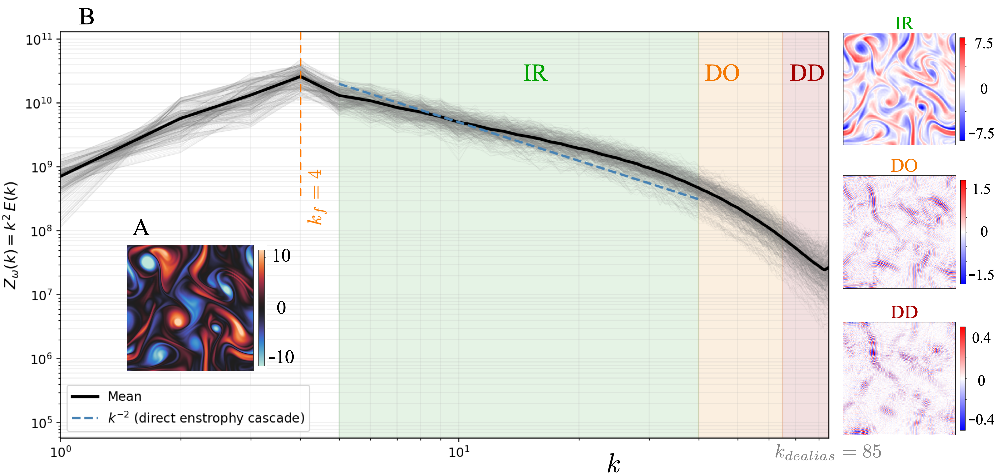
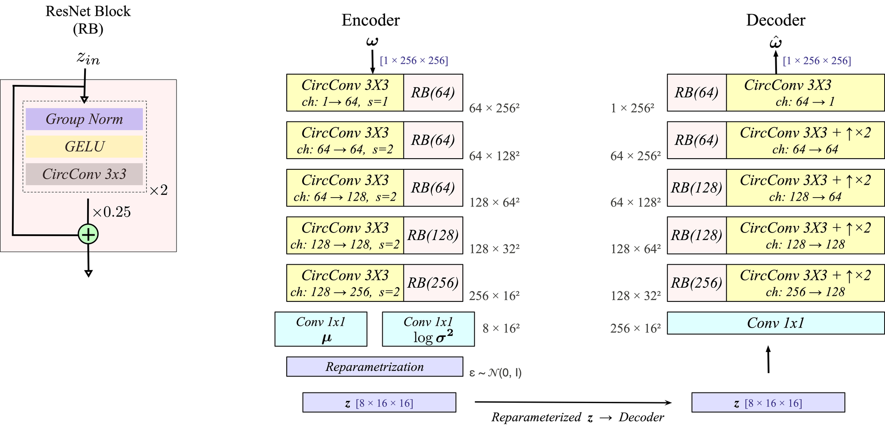
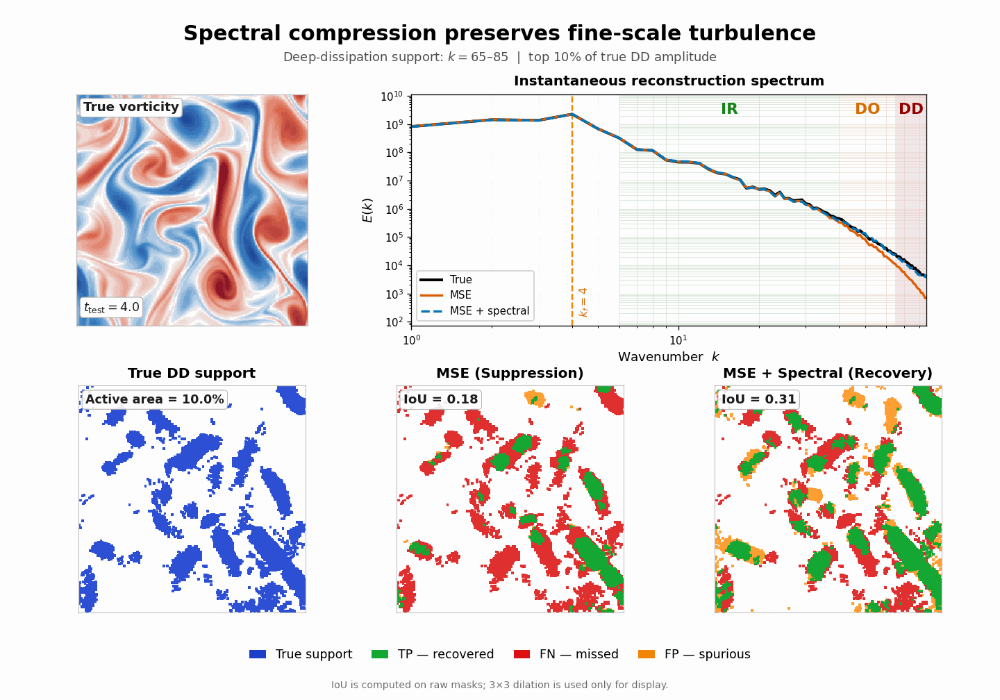
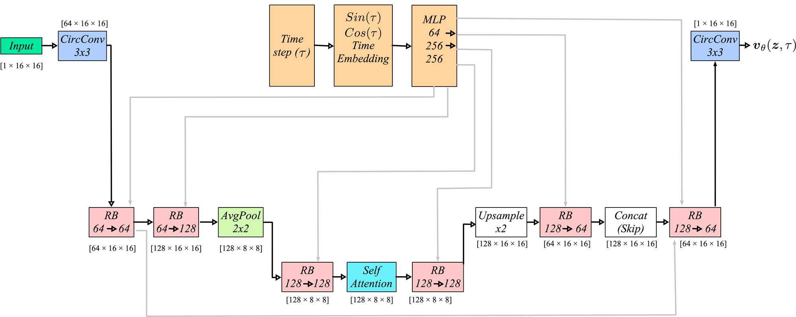

<div align="center">

# Spectrally Regularized Latent Flow Matching for Turbulence Generation

**Khalid Rafiq** · **Aditya G. Nair**
University of Nevada, Reno

**AI4Physics Workshop · ICML 2026 · Seoul**

[](https://openreview.net/forum?id=MEZ1otYgXS)
[](https://arxiv.org/abs/2606.11691)
[](DATASET_LINK)
[](LICENSE)

</div>

---

## The problem: turbulence is multiscale, and MSE only sees the large scales

<p align="center"></p>

Turbulence carries energy from large, energetic eddies down to small, intermittent structures, where viscosity finally dissipates it. We split the resolved spectrum into three zones: the **inertial range** (IR, $k=6$–$40$), the **dissipation onset** (DO, $41$–$65$), and the **deep-dissipation range** (DD, $66$–$85$).

The zones differ enormously in amplitude. Inertial-range vorticity is $\mathcal{O}(\pm 7.5)$, while deep-dissipation vorticity is only $\mathcal{O}(\pm 0.4)$. Under a pointwise $\ell_2$ loss, that 20× gap in amplitude becomes a **~400× gap in how much the loss cares**. An autoencoder trained with MSE can therefore throw away the dissipative scales, where viscosity and the Reynolds number actually act, with almost no penalty.

Latent diffusion and flow-matching models inherit this blind spot from their compression stage. **We fix it where it starts, at the compression bottleneck.**

---

## Stage 1: spectrally regularized compression

<p align="center"></p>

A residual VAE with circular padding compresses a vorticity field $\omega \in \mathbb{R}^{1\times256\times256}$ into a latent $z \in \mathbb{R}^{8\times16\times16}$, a 32× reduction. We train two models with the same architecture and hyperparameters. The only difference between them is the loss.

**Model A (MSE baseline)**

$$
\mathcal{L}_A = \frac{1}{N}\sum_j \Big[\,\lVert \omega_j - \hat\omega_j \rVert_2^2 + \beta\,\mathrm{KL}\big(q_\phi(z\mid\omega_j)\,\Vert\,\mathcal{N}(0,I)\big)\Big]
$$

**Model B (zone-weighted log-spectral)** adds a penalty on the shell-averaged vorticity power $Z_\omega(k)=\frac{1}{|\mathcal{S}_k|}\sum_{\mathbf{k}\in\mathcal{S}_k}|\hat\omega(\mathbf{k})|^2$, measured separately in each zone:

$$
\mathcal{L}_z = \frac{1}{|\mathcal{K}_z|}\sum_{k\in\mathcal{K}_z}\Big[\log\big(Z_{\hat\omega}(k)+\epsilon\big)-\log\big(Z_\omega(k)+\epsilon\big)\Big]^2,
\qquad
\mathcal{L}_B = \mathcal{L}_A + \lambda_{\mathrm{IR}}\mathcal{L}_{\mathrm{IR}} + \lambda_{\mathrm{DO}}\mathcal{L}_{\mathrm{DO}} + \lambda_{\mathrm{DD}}\mathcal{L}_{\mathrm{DD}}
$$

Working in log space puts every scale on equal footing, whatever its amplitude. A Bayesian sweep selects the zone weights $\lambda_{\mathrm{IR}}:\lambda_{\mathrm{DO}}:\lambda_{\mathrm{DD}} = 1:4:6$.

---

## MSE is deceptive: it suppresses the small scales

<p align="center"></p>

Measured by pointwise error, Model A looks slightly *better* than Model B in the deep-dissipation band. The animation shows why that number is misleading. We threshold the true deep-dissipation field at its strongest 10% of amplitude and compare each model's prediction against that support:

- **MSE (suppression).** In sparse, intermittent regions, predicting almost nothing is the cheapest way to keep pointwise error low. Model A misses most of the true support (red) and damps the amplitudes it does capture by about 2×. Its spectrum drops away beyond the inertial range.
- **MSE + spectral (recovery).** The spectral penalty forces Model B to put the missing energy back. It recovers most of the support (green) and about 91% of the amplitude, and its spectrum follows the truth all the way to $k_{\max}=85$. The price is a small increase in pointwise error.

A low MSE on intermittent small-scale structure can therefore mean the model *suppressed* those structures, not that it *reproduced* them faithfully.

| Deep-dissipation retained spectral power | Reconstruction | Generation |
|:--|:--:|:--:|
| Model A: MSE | 25% | 20% |
| Model B: MSE + spectral | **94%** | **79%** |

---

## Stage 2: latent flow matching

<p align="center"></p>

We freeze the VAE, encode the training set with the encoder mean, and train a U-Net velocity field $v_\theta(z,\tau)$ on the linear CondOT path. Given $z_1\sim q(z)$, $\varepsilon\sim\mathcal{N}(0,I)$, $\tau\sim\mathcal{U}[0,1]$, and $z_\tau=(1-\tau)\,\varepsilon+\tau z_1$:

$$
\mathcal{L}_{\mathrm{FM}}(\theta)=\mathbb{E}_{\tau,z_1,\varepsilon}\big\lVert v_\theta(z_\tau,\tau)-(z_1-\varepsilon)\big\rVert_2^2
$$

To sample, we integrate $\mathrm{d}z/\mathrm{d}\tau = v_\theta(z,\tau)$ from $z_0\sim\mathcal{N}(0,T^2I)$ and decode the result. The two Stage 2 generators are identical. Only the latent space they were trained on differs.

**What changes downstream**

- **The latent space sets a quality ceiling.** Generation from the MSE latents stalls near DD bias −0.70, whatever the integrator or number of steps. Generation from the spectral latents reaches −0.12 with only 20 function evaluations.
- **The gain comes from the encoder.** Encoder–decoder swap experiments show the improvement lives mainly in how the encoder reorganizes the latent space, not in decoder capacity.
- **The cascade physics survives.** Both pipelines reproduce $S_2(r)$ and the correct negative sign of $S_3(r)$, and hence the direction of the cascade, without any supervision on structure functions.

---

## Repository

```
├── physics/                   dataset characterization (multiscale figure, dataset table)
├── compression/               Stage 1
│   ├── models.py              residual VAE
│   ├── losses.py              MSE + KL, zone log-spectral loss
│   ├── spectral.py            band-pass filter, isotropic spectrum
│   ├── train_vae.py
│   ├── sweep.yaml             Bayesian sweep over (λ_IR, λ_DO, λ_DD)
│   └── notebooks/             uniform vs. weighted spectral VAE, swap and support diagnostics
├── generation/                Stage 2
│   ├── unet.py                velocity field
│   ├── sampling.py            Euler / Heun / RK4, prior calibration
│   ├── structure_functions.py
│   ├── encode_latents.py
│   ├── train_fm.py
│   └── notebooks/             generation, solver study, structure functions
├── checkpoints/               pretrained VAEs and flow models
└── data/                      download instructions
```

| Checkpoint | Description |
|:--|:--|
| `compression/best_A_lat16_mse.pt` | Model A, MSE only |
| `compression/best_B_lat16_mse_spec.pt` | Uniform spectral weights ($\lambda=4\times10^{-3}$ in every zone) |
| `compression/best_B_lat16_weighted_mse_spec.pt` | Model B, zone-weighted 1 : 4 : 6 |
| `generation/best_fm_A_lat16_mse.pt` | Flow model on Model A latents |
| `generation/best_fm_B_lat16_weighted_mse_spec.pt` | Flow model on Model B latents |

## Getting started

```bash
git clone https://github.com/Khalid-Rafiq-01/spectrally-regularized-turb-gen.git
cd spectrally-regularized-turb-gen
pip install -r requirements.txt
```

Download `trajectory_real.npy` into `data/` (see [data/README.md](data/README.md)).

**Reproduce the paper with the pretrained checkpoints.** Run these from the repository root:

```bash
python -m generation.encode_latents --vae_name A_lat16_mse
python -m generation.encode_latents --vae_name B_lat16_weighted_mse_spec
```

Then run the notebooks in this order: `physics/` → `compression/notebooks/` → `generation/notebooks/`.

**Train from scratch.**

```bash
python -m compression.train_vae --name A_lat16_mse
python -m compression.train_vae --name B_lat16_weighted_mse_spec --w_ir 1e-3 --w_do 4e-3 --w_dd 6e-3
python -m generation.encode_latents --vae_name A_lat16_mse
python -m generation.encode_latents --vae_name B_lat16_weighted_mse_spec
python -m generation.train_fm --vae_name A_lat16_mse
python -m generation.train_fm --vae_name B_lat16_weighted_mse_spec
```

## Citation

```bibtex
@inproceedings{rafiq2026spectral,
  title     = {Spectrally Regularized Latent Flow Matching for Turbulence Generation},
  author    = {Rafiq, Khalid and Nair, Aditya G.},
  booktitle = {AI4Physics Workshop at the 43rd International Conference on Machine Learning},
  year      = {2026}
}
```

## Acknowledgements

This work was supported by the NSF AI Institute in Dynamic Systems (Award No. 2112085) and a DOE Early Career Research Award (Award No. DE-SC0022945). The DNS data was generated with [jax-cfd](https://github.com/google/jax-cfd).
